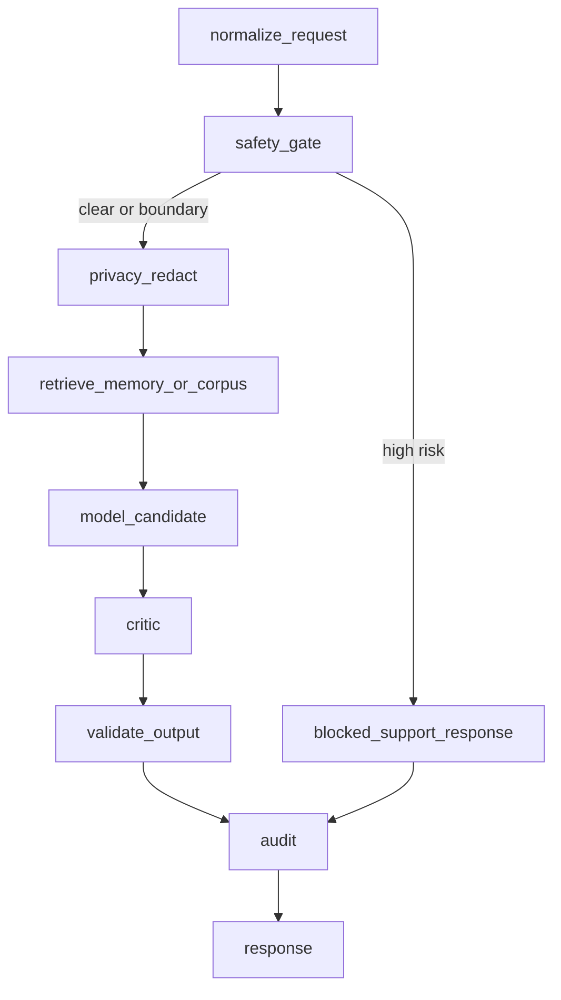

# Future LangGraph Flow

Rules:

- High-risk input returns a non-gameplay blocked result.
- Boundary pressure cannot generate reward signals.
- Player raw text cannot enter global training without consent, redaction, summarization, human review, and eval pass.
- The game adapter remains responsible for applying or rejecting game actions.
- Frontend clients do not hold provider API keys.
- Gateway / LangGraph / model advisors stay advisory and `trusted: false`.
- RaphaelCore remains final authority for safety, boundary, memory, state, response, and gameplay reward policy.
- Unsupported canon questions must abstain unless a reviewed source citation is retrieved.
